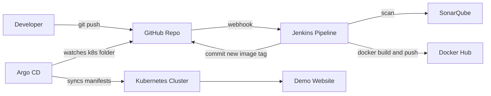

# Kubernetes CI/CD Demo Website

This repository is a manager-friendly demo for an automated deployment workflow using:

- GitHub for source control
- Jenkins for CI automation
- SonarQube for code quality scanning
- Docker for container image creation
- Kubernetes for runtime deployment
- Argo CD for GitOps-based deployment automation

## Architecture



## Repository structure

```text
.
├── src/                         # Static website files
├── scripts/                     # Simple lint and test checks
├── k8s/                         # Kubernetes manifests watched by Argo CD
├── argocd/application.yaml       # Argo CD Application manifest
├── Dockerfile                   # Nginx image for the website
├── Jenkinsfile                  # CI pipeline
├── sonar-project.properties     # SonarQube project settings
└── docs/                        # Setup and demo notes
```

## End-to-end CI/CD flow

1. Developer modifies website code in `src/`.
2. Developer pushes the change to GitHub.
3. GitHub webhook triggers Jenkins.
4. Jenkins checks out the code, runs lint/test, and scans with SonarQube.
5. Jenkins builds a Docker image and pushes it to Docker Hub.
6. Jenkins updates `k8s/deployment.yaml` with the new image tag and pushes that manifest change back to GitHub.
7. Argo CD detects the changed manifest and syncs it to Kubernetes.
8. Kubernetes rolls out the updated website pods.

## Required replacements

Before using this repo, replace these placeholders:

| Placeholder | Replace with |
|---|---|
| `YOUR_GITHUB_USER` | Your GitHub username or organization |
| `YOUR_DOCKERHUB_USER` | Your Docker Hub username or organization |
| `dockerhub-creds` | Jenkins credential ID for Docker Hub username/password |
| `github-token` | Jenkins credential ID for GitHub personal access token |
| `sonarqube-server` | Jenkins SonarQube server configuration name |

Recommended search command after cloning:

```bash
grep -R "YOUR_" -n .
```

## Local test

```bash
npm install
npm run lint
npm test

docker build -t k8s-cicd-demo-site:local .
docker run --rm -p 8080:80 k8s-cicd-demo-site:local
```

Open:

```text
http://localhost:8080
```

## Jenkins setup

Install/configure these Jenkins plugins or capabilities:

- Pipeline
- Git / GitHub integration
- Docker CLI access on the Jenkins agent
- SonarQube Scanner for Jenkins
- NodeJS, or a Jenkins agent that already has Node.js installed

Create Jenkins credentials:

| Credential ID | Type | Purpose |
|---|---|---|
| `dockerhub-creds` | Username with password | Allows Jenkins to push Docker images |
| `github-token` | Secret text | Allows Jenkins to push the updated manifest to GitHub |

Configure SonarQube in Jenkins:

1. Go to **Manage Jenkins → System**.
2. Add a SonarQube server named `sonarqube-server`.
3. Ensure the Jenkins agent has `sonar-scanner` available in `PATH`.

Create a Jenkins Pipeline job from SCM:

1. Repository URL: your GitHub repository URL.
2. Branch: `main`.
3. Script path: `Jenkinsfile`.
4. Add a GitHub webhook pointing to:

```text
http://JENKINS_URL/github-webhook/
```

The Jenkinsfile commits manifest updates using `[skip ci]`. The pipeline also skips Jenkins-generated `[skip ci]` commits to avoid an infinite build loop.

## Kubernetes setup

Apply manifests manually once, or let Argo CD do it. To apply manually:

```bash
kubectl apply -k k8s/
kubectl get pods -n demo-site
kubectl port-forward svc/k8s-cicd-demo-site -n demo-site 8080:80
```

Then open:

```text
http://localhost:8080
```

## Argo CD setup

Install Argo CD in your cluster if it is not already installed. Then update `argocd/application.yaml` with your real GitHub repo URL and run:

```bash
kubectl apply -f argocd/application.yaml
argocd app get k8s-cicd-demo-site
argocd app sync k8s-cicd-demo-site
```

Argo CD will continuously watch the `k8s/` folder and deploy changes automatically.

## Manager demo script

Use this sequence during the demo:

1. Open the website running from Kubernetes.
2. Show the current image in the deployment:

```bash
kubectl get deployment k8s-cicd-demo-site -n demo-site -o=jsonpath='{.spec.template.spec.containers[0].image}'
```

3. Change a line in `src/index.html`, for example the hero title.
4. Commit and push:

```bash
git add src/index.html
git commit -m "demo: update homepage title"
git push origin main
```

5. Show Jenkins running automatically.
6. Show SonarQube scan completed.
7. Show Docker image pushed.
8. Show Jenkins committing the new image tag to `k8s/deployment.yaml`.
9. Show Argo CD syncing the change.
10. Refresh the Kubernetes-hosted website and show the updated text.

## Troubleshooting

### Jenkins cannot push Docker image

Check that:

- Docker is installed on the Jenkins agent.
- Jenkins has permission to run Docker commands.
- `dockerhub-creds` is configured correctly.
- `DOCKER_REPO` in `Jenkinsfile` uses your real Docker Hub user or org.

### Argo CD does not sync

Check that:

- `repoURL` in `argocd/application.yaml` points to your GitHub repo.
- Argo CD has access to the repo.
- The `path` is `k8s`.
- Auto-sync is enabled in the Application manifest.

### Website is not reachable

Use port-forward first:

```bash
kubectl port-forward svc/k8s-cicd-demo-site -n demo-site 8080:80
```

Then open `http://localhost:8080`.

For ingress access, install an ingress controller and map `demo-site.local` to your cluster ingress IP.
